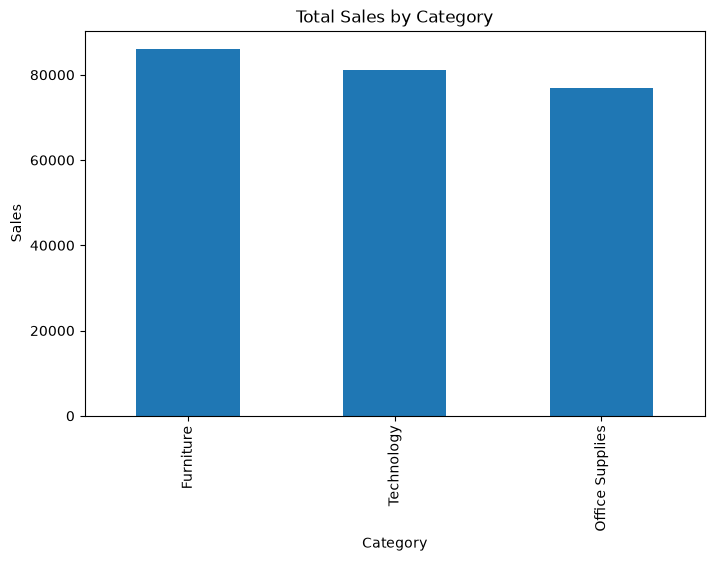
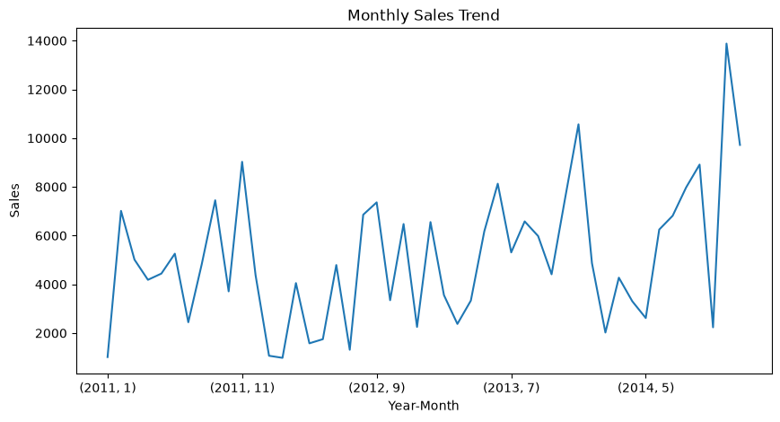
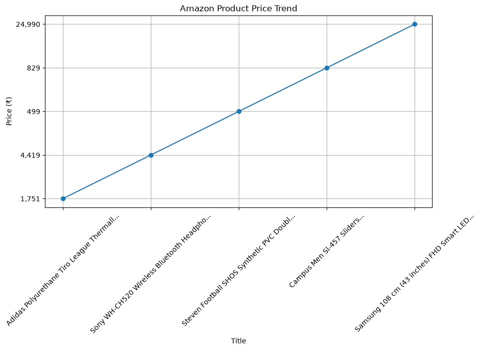
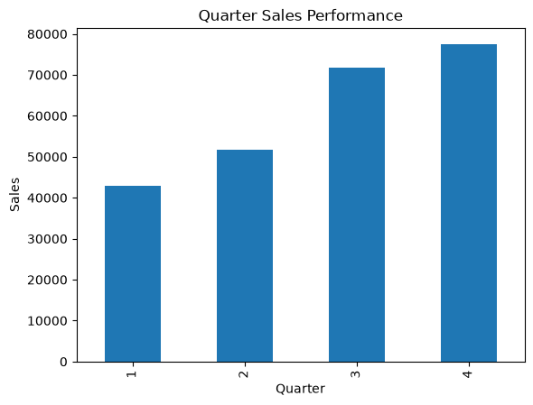
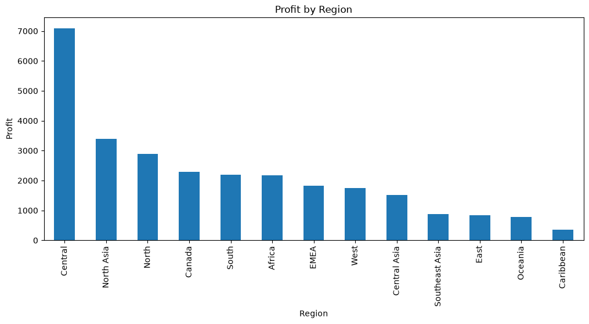
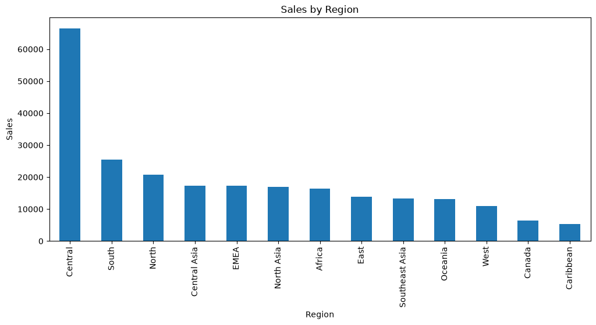
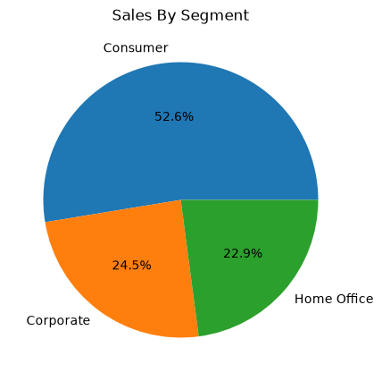
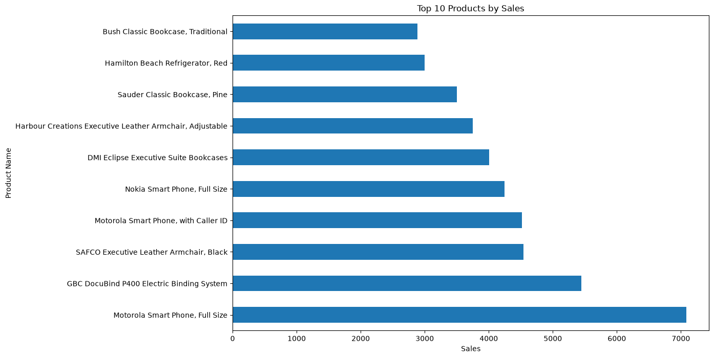
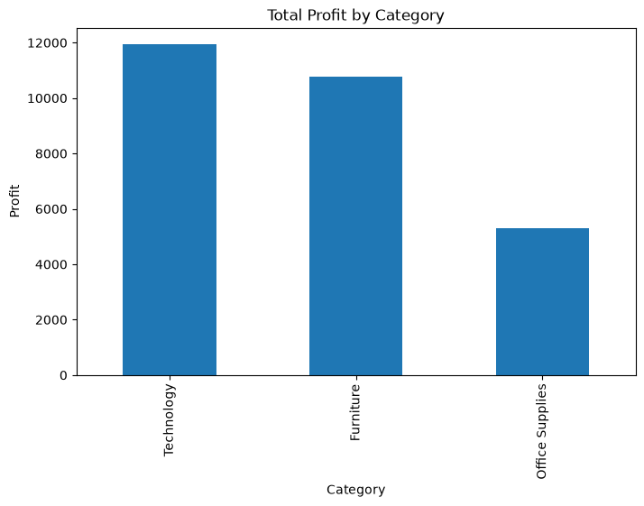

# Retail Sales & Profit Analytics

## End-to-End Data Analytics Project

## 📌 Project Overview

Retail businesses generate large amounts of sales data that contain valuable insights about customer behavior, product performance, revenue trends, and profitability.

This project focuses on analyzing retail sales data to identify meaningful patterns and trends using Python-based data analytics techniques.

The project includes:
- Data Understanding
- Data Cleaning
- Exploratory Data Analysis (EDA)
- Data Visualization
- Business Insight Generation

The analysis helps identify key revenue drivers, profitable categories, customer segments, and opportunities for business improvement.

---

# 🎯 Business Objective

The objective of this project is to analyze retail sales data to:

- Understand overall sales and profit performance.
- Identify high-performing customer segments and regions.
- Analyze product and category-level performance.
- Discover sales trends over time.
- Evaluate profitability and identify improvement opportunities.
- Generate actionable insights for data-driven decision-making.

---

# 🛠️ Tools & Technologies Used

- Python
- Pandas
- NumPy
- Matplotlib
- Seaborn
- Jupyter Notebook

---

# 📂 Project Workflow

1. Data Understanding
2. Data Cleaning
3. Feature Engineering
4. Exploratory Data Analysis
5. Data Visualization
6. Business Insights

---

# 📊 Exploratory Data Analysis (EDA)

## 1. Overall Business Performance

Key Performance Indicators (KPIs) were calculated to understand overall business performance:

- Total Sales
- Total Profit
- Total Orders
- Total Customers

 

---

# 2. Segment Analysis

Customer segment analysis was performed to understand sales contribution from different customer groups.

Analyzed:
- Sales by Segment
- Profit by Segment

### Key Insight:
- Identified the customer segments contributing the highest revenue and profitability.

---

# 3. Region Analysis

Regional analysis was performed to compare sales and profit performance across different geographical regions.

Analyzed:
- Region-wise Sales
- Region-wise Profit

### Key Insight:
- Identified high-performing regions and areas requiring improvement.

---

# 4. Category Analysis

Category-level analysis was performed to understand which product categories generate maximum revenue.

Analyzed:
- Sales by Category
- Profit by Category

### Key Insight:
- Identified top-performing categories based on sales and profitability.

---

# 5. Product Analysis

Product analysis was performed to identify products contributing most to business revenue.

Analyzed:
- Top Products by Sales
- Top Products by Profit

### Key Insight:
- Identified best-selling products and products with strong profit contribution.

---

# 6. Time Trend Analysis

Sales trends were analyzed across different time periods to identify growth patterns and seasonal variations.

Analyzed:
- Yearly Sales Trend
- Monthly Sales Trend
- Quarterly Sales Trend

### Key Insight:
- Identified seasonal patterns and changes in sales performance over time.

---

# 7. Profit Analysis

Profitability analysis was performed to understand business performance.

Analyzed:
- Profit Distribution
- Profit Margin
- Category-wise Profit
- Region-wise Profit

### Key Insight:
- Identified factors affecting profitability and areas for optimization.

---

# 💡 Key Business Insights

- Evaluated overall sales and profitability using business KPIs.
- Identified top-performing customer segments.
- Analyzed regional sales and profit contribution.
- Determined high-performing product categories.
- Identified top revenue-generating products.
- Discovered sales trends and seasonal patterns.
- Generated insights to support strategic business decisions.

---

# ✅ Conclusion

This Retail Sales & Profit Analytics project demonstrates an end-to-end data analytics workflow using Python.

Through data cleaning, exploratory data analysis, and visualization, the project transformed raw retail data into meaningful business insights.

The findings can help businesses improve sales strategies, optimize inventory planning, focus on profitable products, and make data-driven decisions.

---

# 📁 Repository Contents
